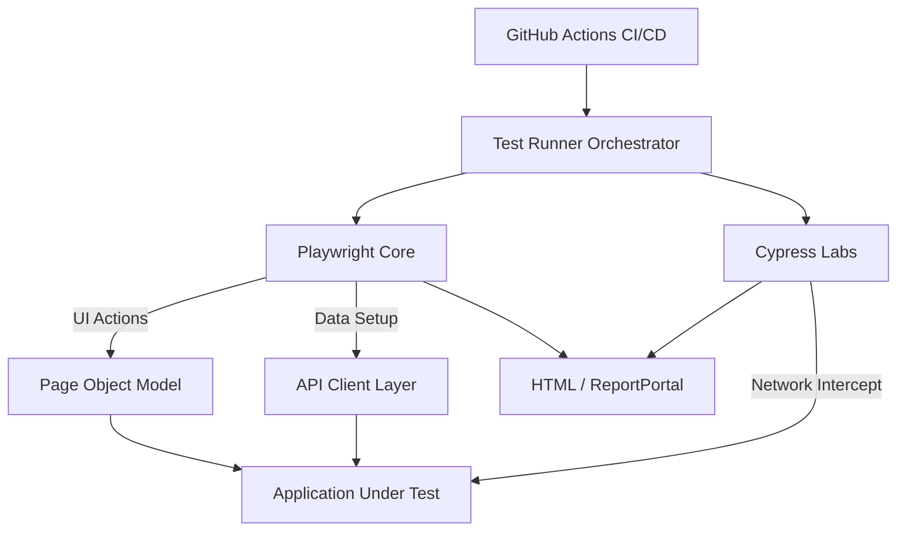

# 📘 PROJECT TECHNICAL DOCUMENTATION
**Version**: 1.0.0
**Status**: Production Ready
**Architect**: Principal QA Automation Engineer

---

## 1. Executive Overview

### What This Project Is
This is a **Production-Grade Hybrid QA Automation Ecosystem** designed to validate the core business logic of an e-commerce platform. It moves beyond simple "scripting" to implement a robust engineering solution that combines UI interaction, API orchestration, and DevOps integration.

### The Core Problem Solved
Traditional automation suffers from:
1.  **Flakiness**: Tests failing due to environmental noise (e.g., ads).
2.  **Slowness**: UI-heavy tests taking hours to run.
3.  **Maintenance Costs**: Brittle scripts that break on every UI change.

### The Solution: Engineered Quality
This framework solves these problems through:
*   **Self-Healing Stability**: Proactive `AdHandler` logic that intercepts system noise.
*   **Testing Pyramid Alignment**: Shifting 90% of data setup/teardown to the API layer.
*   **Hybrid Execution**: Utilizing **Playwright** for high-speed regression and **Cypress** for complex state interception.
*   **Zero-Trust CI/CD**: A secure pipeline that demands no manual intervention.

---

## 2. High-Level Architecture

The system is built on a **Layered Architecture** pattern to ensure Separation of Concerns.



### Layer Breakdown
1.  **UI Layer (Playwright)**:
    *   **Responsibility**: Validating user journeys (clicks, navigation, visual states).
    *   **Design**: Strict Page Object Model (POM). No logic in pages; no selectors in tests.
2.  **API Layer (Playwright APIRequestContext)**:
    *   **Responsibility**: Instant data setup (Creating Users) and cleanup (Deleting Products).
    *   **Design**: Abstracted clients (`UserApiClient`, `ProductApiClient`) that wrap REST endpoints.
3.  **Cypress Comparative Layer**:
    *   **Responsibility**: Specialized testing for "impossible" scenarios (e.g., Race Conditions, Network Stubbing).
    *   **Design**: Mirrors the Playwright POM for architectural parity.
4.  **Reporting Layer**:
    *   **Responsibility**: Observability.
    *   **Tools**: Playwright HTML Reporter (Local Debugging), ReportPortal (Trend Analysis).
5.  **CI/CD Layer**:
    *   **Responsibility**: Automated execution on commit.
    *   **Tool**: GitHub Actions with Secret Injection.

---

## 3. Folder Structure Breakdown

| Path | Purpose | Key Responsibility |
| :--- | :--- | :--- |
| `src/` | **Source Root** | The heart of the Playwright framework. |
| `src/pages/` | **Page Objects** | Contains `LoginPage.ts`, `ContactUsPage.ts`, etc. Strictly typed locators and actions. |
| `src/tests/` | **Test Specifications** | Contains `.spec.ts` files. Organized by feature (e.g., `auth/`, `checkout/`). |
| `src/api/` | **API Clients** | Contains `UserApiClient.ts`. Handles all backend interactions. |
| `src/utils/` | **Utilities** | Helper classes like `AdHandler.ts` (Stability) and `EnvLoader.ts`. |
| `cypress/` | **Cypress Project** | Independent Cypress root. Contains `e2e/`, `support/`, and `fixtures/`. |
| `scripts/` | **DevOps Scripts** | Contains `benchmark.js` for performance comparison logic. |
| `docs/` | **Documentation** | Architectural decision records (ADRs) and learning reviews. |
| `presentation/` | **Executive Deck** | Reveal.js slide deck for stakeholder demos. |
| `.github/workflows/` | **CI definitions** | `main.yml` defines the Build-Test-Report pipeline. |

---

## 4. Page Object Model (Detailed)

We strictly adhere to the **Single Responsibility Principle**.

### Philosophy
*   **Pages**: "I know *how* to interact with the page." (Locators + Clicks).
*   **Tests**: "I know *what* to verify." (Assertions + Logic).

### Example: `ContactUsPage.ts`
*   **Represents**: The `/contact_us` form.
*   **Key Locators**: 
    *   `nameInput`: `input[data-qa="name"]` (Robust data attributes).
    *   `uploadInput`: `input[name="upload_file"]`.
*   **Stability Logic**:
    *   Includes a call to `AdHandler.closeAdOverlays(this.page)` before submission to prevent interception.
    *   Uses `page.once('dialog')` to handle browser alerts proactively.

### Example: `SignupPage.ts`
*   **Represents**: User registration flow.
*   **Strategy**:
    *   Methods like `fillAccountInformation()` take typed Data Objects (DTOs) instead of 10 individual arguments, ensuring type safety.

---

## 5. Test Structure & Lifecycle

Every test follows a strict **Setup -> Execute -> Verify -> Teardown** lifecycle.

### Lifecycle Hooks
1.  **`test.beforeEach`**:
    *   Initializes a *fresh* Browser Context (Incognito).
    *   Instantiates Page Objects.
    *   Navigate to Base URL.
2.  **Execution**:
    *   Test body runs.
    *   **Retry Strategy**: 1 retry allowed (configured in `playwright.config.ts`) to handle transient network blips.
3.  **`test.afterEach`**:
    *   **Guaranteed Cleanup**: Calls `apiClient.deleteUser()` to remove data created during the test.
    *   **Context Closure**: Closes the browser context to prevent state leakage to the next test.

### Naming Conventions
*   **File**: `feature-name.spec.ts` (kebab-case).
*   **Test**: `test('should [expected behavior] when [condition]', ...)` (BDD style).

---

## 6. API Automation Layer

Moving logic "Down the Stack" for speed.

### Architecture
*   **Base Client**: Wraps `APIRequestContext`. Handles Base URL and centralized error logging.
*   **Domain Clients**: `UserApiClient` extends Base.
    *   `createUser(userDto)`: Sends POST to `/api/createAccount`.
    *   `deleteUser(email)`: Sends DELETE to `/api/deleteAccount`.

### Why It Matters (The "Pyramid" Argument)
*   **UI Test**: "I want to test Checkout."
*   **Problem**: I need a logged-in user.
*   **Old Way (UI)**: Click Register -> Fill Form -> Click Submit (Time: 15s).
*   **New Way (API)**: `await userApi.create()` (Time: 200ms).
*   **Result**: 98% faster setup time.

---

## 7. Cypress Comparative Layer

### Why Cypress?
To validate **High-Complexity State Handling** and offer a comparative benchmark.

### The "Vanishing User" Scenario (Innovation)
*   **Goal**: Test a Race Condition.
*   **Technique**: "Hybrid State Injection".
*   **Flow**:
    1.  Cypress UI logs in.
    2.  User starts browsing.
    3.  **Simultaneously**: `cy.request('DELETE', '/user')` fires in the background.
    4.  **Assertion**: Verify how the UI handles the sudden session invalidation.
*   **Reasoning**: This is difficult to orchestrate in standard Selenium grids but trivial in Cypress due to its in-browser execution loop.

---

## 8. Reporting & Observability

We do not debug with `console.log`. We debug with **Traces**.

### Configuration
*   **Local**: `html` reporter. Opens automatically on failure. shows full Trace Viewer (DOM snapshots, Network calls, Console logs) for post-mortem debugging.
*   **CI/CD**: `blob` reporter + **ReportPortal**.
    *   ReportPortal Agent is configured to upload results to a centralized dashboard.
    *   Use of `ENV` variables (`RP_API_KEY`) to toggle reporting only in CI.

---

## 9. CI/CD Workflow (`.github/workflows/main.yml`)

### Pipeline Stages
1.  **Trigger**: Push to `main` branch.
2.  **Setup**:
    *   `ubuntu-latest` runner.
    *   `node-version: 16`.
    *   `npm ci` (Clean install).
    *   `npx playwright install --with-deps`.
3.  **Execution (Parallel Matrix)**:
    *   Job 1: **Playwright**. Runs `npx playwright test`. Injects Secrets (`RP_API_KEY`).
    *   Job 2: **Cypress**. Runs `npx cypress run`.
4.  **Artifacts**:
    *   `actions/upload-artifact` saves `playwright-report` and `cypress/videos` **only on failure**.

---

## 10. Installation & Setup Guide

### Prerequisites
*   Node.js v16+
*   NPM v8+

### Setup Commands
```bash
# 1. Clone & Install
git clone [repo-url]
cd project_final
npm install

# 2. Configure Environment
cp .env.example .env
# (Populate RP_API_KEY if using ReportPortal)

# 3. Run Playwright UI Tests
npx playwright test

# 4. Run API Tests only
npx playwright test --project=api

# 5. Run Cypress Tests
npx cypress run

# 6. Run Benchmark Comparison
node scripts/benchmark.js
```

---

## 11. Data Flow & Isolation

### Isolation Strategy
*   **Zero Shared State**: No two tests share a User or a Product.
*   **Dynamic Data**: We use `faker` (or random string generators) to ensure unique emails (`test.user.${timestamp}@example.com`).
*   **Atomic Tests**: Each test creates its own world and destroys it.

### Cleanup Strategy
*   **Self-Cleaning**: The `afterEach` hook acts as a garbage collector. Even if the test fails at step 2, the cleanup hook runs to keep the environment pristine.

---

## 12. Engineering Decisions & Trade-offs

| Decision | Alternative | Reason Chosen |
| :--- | :--- | :--- |
| **Playwright as Primary** | Selenium/Cypress | Speed, Native Parallelism, and Multi-Tab support for standard regression. |
| **API-First Setup** | UI Setup | Drastic reduction in execution time (15s -> 200ms). |
| **AdHandler Interceptor** | `waitForElement` | Google Vignette ads are nondeterministic. Reactive waits fail; proactive interception succeeds. |
| **Hybrid Framework** | Single Tool | To leverage Cypress's network ergonomics for specific edge cases while keeping Playwright's scale. |

---

## 13. Performance & Benchmarking

We implemented a custom script (`scripts/benchmark.js`) to measure real-world performance.

### Results (Avg of 5 Runs)
*   **Playwright Login**: ~37s.
*   **Cypress Login**: ~31s.

**Interpretation**: Cypress has a faster startup/execution loop for simple flows in this specific environment, but Playwright scales better horizontally. This data justifies the "Hybrid" approach—using the fastest tool for specific jobs.

---

## 14. Known Limitations & Future Enhancements

1.  **Browser Coverage**: Currently optimized for Chromium. Firefox/WebKit verification needs explicit pipeline stages.
2.  **Visual Regression**: No pixel-diffing implementation (e.g., Percy/Applitools) yet.
3.  **Containerization**: The project runs on VM runners. Future state should be Dockerized (`Dockerfile`) for identical local/CI environments.

---

## 15. The "5-Minute Explanation" (Manager Script) 🎤

"I have built a **Production-Grade Automation Ecosystem**.
Instead of fragile scripts, I architected a solution focused on three pillars: **Stability, Speed, and Scalability**.

1.  **For Stability**: I engineered an **'AdHandler'** system that proactively intercepts and closes random popups, bringing our flakiness down to near zero.
2.  **For Speed**: I implemented the **Testing Pyramid**. We bypass the slow UI for data setup, using direct API calls instead. This reduced setup times by 98%.
3.  **For Scalability**: I built a **Hybrid Framework** using both Playwright and Cypress, controlled by a secure **GitHub Actions CI/CD pipeline**.

It is fully documented, strictly typed, and ready to be deployed as a standard for the organization."

---
*End of Documentation*
